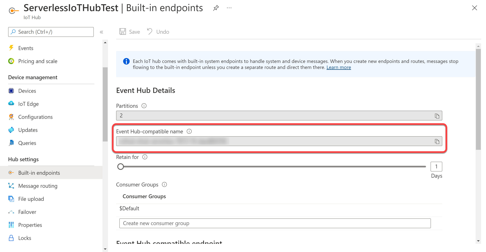
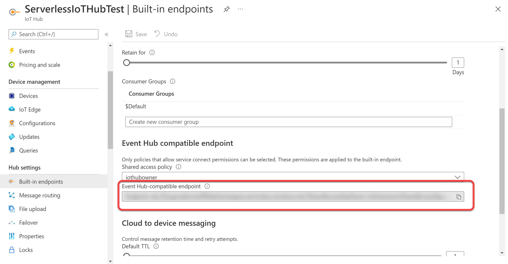
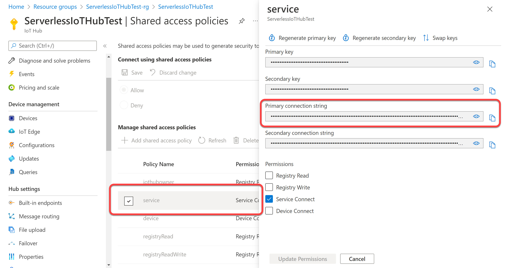

# AppSettings configuration

The app settings looks like the following:

```json
{
  "IsEncrypted": false,
  "Values": {
    "AzureWebJobsStorage": "",
    "FUNCTIONS_WORKER_RUNTIME": "dotnet",
    "TwilioAccountSid": "",
    "TwilioAuthToken": "",
    "TwilioFromNumber": "",
    "IotHubName": "",
    "EventHubCompatibleConnectionString": "",
    "IotHubConnectionString":"",
    "StorageCapture:ConnectionString": "",
    "StorageCapture:ContainerName": ""
  }
}
```

* `AzureWebJobsStorage` : the function app storage account connection string. Use `UseDevelopmentStorage=true` for local test.
* `TwilioAccountSid` : The Twilio Account SID used by the functions to notify temperature threshold with SMS. Read <a href="https://www.twilio.com/docs/sms/send-messages" target="_blank">this</a> to understand how create a Twilio Account.
* `TwilioAuthToken` : The Twilio Auth Token used by the functions to notify temperature threshold with SMS. Read <a href="https://www.twilio.com/docs/sms/send-messages" target="_blank">this</a> to understand how create a Twilio Account.
* `TwilioFromNumber` : The Twilio Virtual Phone Number used by the functions to notify temperature threshold with SMS. Read <a href="https://www.twilio.com/docs/sms/send-messages" target="_blank">this</a> to understand how create a Twilio Account.
* `IotHubName` : The Event Hub-compatible name value you can find in the built-in endpoints blade of the IoTHub in Azure portal.



* `EventHubCompatibleConnectionString` : The Event Hub-compatible endpoint you can find in the built-in endpoints blade of the IoTHub in Azure portal.



* `IotHubConnectionString` : The IoT Hub connection string. It is used by the platform to send message to devices. You can find it in the "Shared Access Policies" blade of the portal.



* `StorageCapture:ConnectionString` : the connection string of the Storage Account you want to use to store capture data from devices. The Storage capture is the feature that allow you to create an export blob (csv format) from every single device with telemetry data.

* `StorageCapture:ContainerName` : the name of the container in which the storage capture feature save the capture blobs. The feature will create a folder for each device and save csv blob withe the datetime of the capture.
