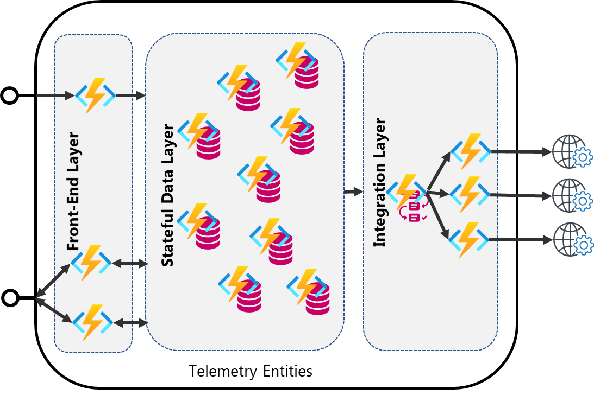

# Telemetry Entities

In this solution, we use Durable Entities to manage each single device and their states.
Logically, the architecture is split in three different layer:

* **Front-End Layer**: this layer contains Azure Functions (client functions) that expose Rest APIs to send telemetry, search devices and retrieve status for each device;
* **Stateful Data Layer**: this layer contains Durable Entities that provide stateful layer to manage status for each device;
* **Integration Layer**: consists of Durable Functions that provide integration with external services and allow you to create complex workflow to integrate more than one external service.

To configure the app settings value, read the [Configuration](Documentation/Configuration.md) document.
