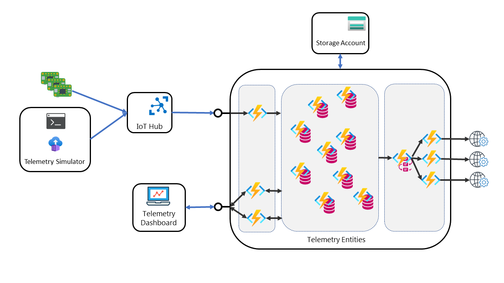

# ServerlessIoT

Simple IoT sulution that use Durable Entities to store information and status of your devices.

The components of the sample are:

- **Telemetry Simulator**: It is a devices simulator that allow you to simulate a set of devices sending event to an IotHub. The project for this component is [here](Frontend/TelemetrySimulator/README.md).

- **Telemetry Entities**: This component contains the APIs to send telemetry to the Durable Entities (used by the Telemetry Dispatcher) and to retrieve data from the entities (used by the dashboard), and the Durable Entities, one for each device managed by the IoTHub. The project for this component is [here](Backend/TelemetryEntities/README.md). 

- **Telemetry Dashboard**: It is a WPF client application that show information and data from the devices contain in the Telemetry Entities component. The project for this component is [here](Frontend/TelemetryDashboard.WPF/README.md). 